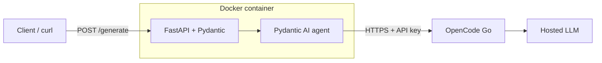
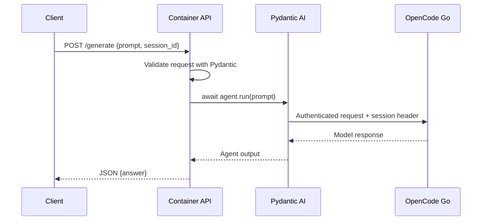

# Docker → Pydantic AI → OpenCode Go

Host a small Python API in Docker that accepts a prompt, calls OpenCode Go, and returns JSON. This outline assumes **FastAPI** serves HTTP, **Pydantic** validates request/response data, and **Pydantic AI** makes the LLM call. The model runs on the provider's infrastructure.



The current `dockerfile` installs `curl`, `git`, and `uv`, then switches to `agent`. To complete the service:

1. **Prepare Python dependencies.** Add `pyproject.toml` and `uv.lock` with FastAPI, Uvicorn, and Pydantic AI. Install `uv` somewhere accessible to `agent` (such as `/usr/local/bin`); the current installation under `/root/.local/bin` may be inaccessible after switching users.
2. **Create the API.** Add `app.py` with `GET /health` and `POST /generate`. Define a request containing `prompt` and `session_id`, then return a response containing `answer`. In the async handler, await the agent run and return its output. Start with text output; add a structured Pydantic AI output model when needed.
3. **Connect the provider.** Read the API key, base URL, and model ID from environment variables. For a Chat Completions model, configure `OpenAIChatModel` with `OpenAIProvider(base_url=..., api_key=...)`. Pydantic AI supports custom OpenAI-compatible endpoints. [Provider configuration](https://pydantic.dev/docs/ai/models/openai/)
4. **Finish the image.** Set a working directory, copy the application and dependency files, install locked dependencies, and start `uv run uvicorn app:app --host 0.0.0.0 --port 8000`. Ensure the application and its environment are accessible to `agent`.
5. **Build, run, and verify.** Inject configuration at runtime, publish port 8000, check `/health`, then send a prompt to `/generate`. Check that invalid inputs and provider failures return clear HTTP errors.

Suggested runtime configuration in a gitignored `.env`:

```dotenv
OPENCODE_API_KEY=<your-key>
OPENCODE_BASE_URL=https://opencode.ai/zen/go/v1
OPENCODE_MODEL=glm-5.1
```

These are application-defined variable names; read them explicitly in `app.py`. Use the bare model ID for direct API calls. The base URL excludes `/chat/completions`; the client appends it. Choose a model with that endpoint in the [OpenCode Go model table](https://opencode.ai/docs/go/#endpoints).

OpenCode Go is intended for coding-agent traffic. Send your application's own `User-Agent` and an `x-opencode-session` header that stays stable for each conversation. Configure these on outbound provider requests. [Go client requirements](https://opencode.ai/docs/go/#where-can-i-use-it)



Once the application and Dockerfile steps above are implemented:

```bash
docker build -f dockerfile -t opencode-api .
docker run --rm --env-file .env -p 127.0.0.1:8000:8000 opencode-api
```

From another terminal:

```bash
curl http://localhost:8000/health
curl http://localhost:8000/generate \
  -H 'Content-Type: application/json' \
  -d '{"prompt":"Explain Python list comprehensions.","session_id":"demo-1"}'
```
