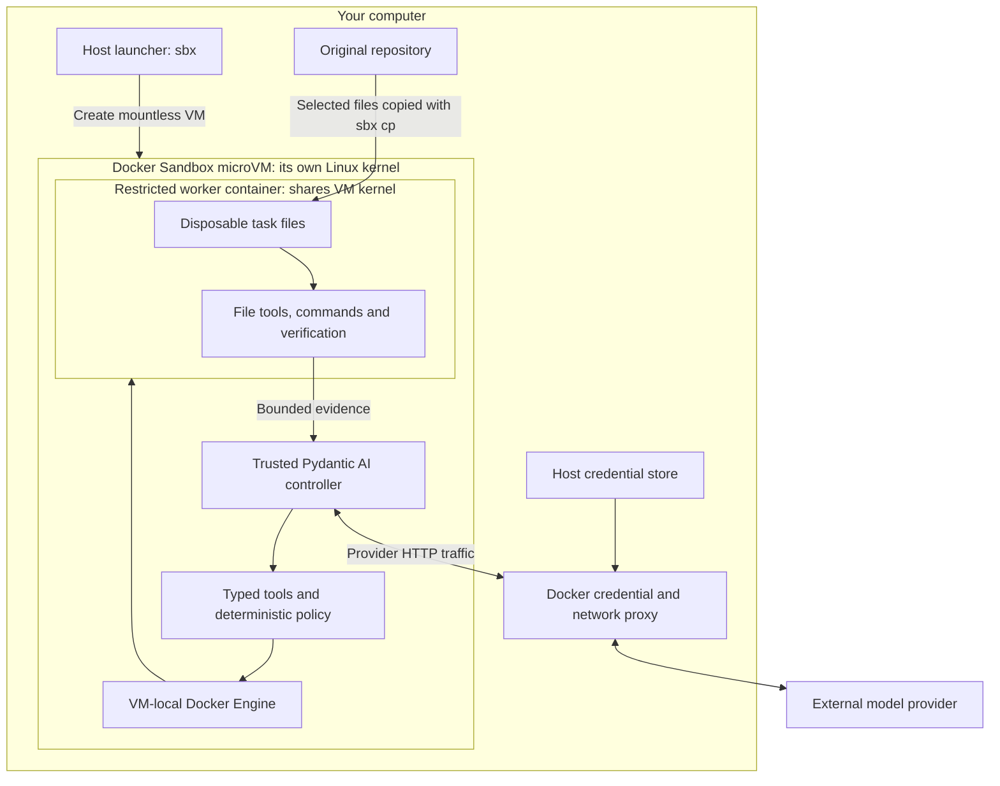
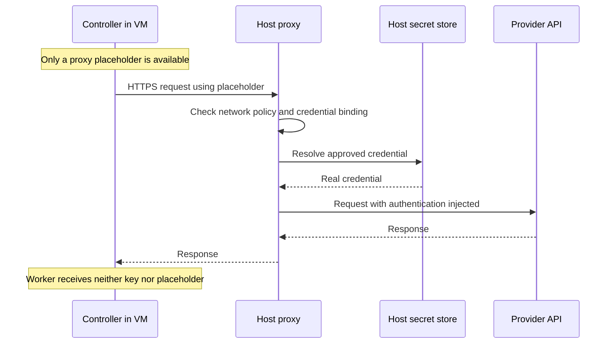
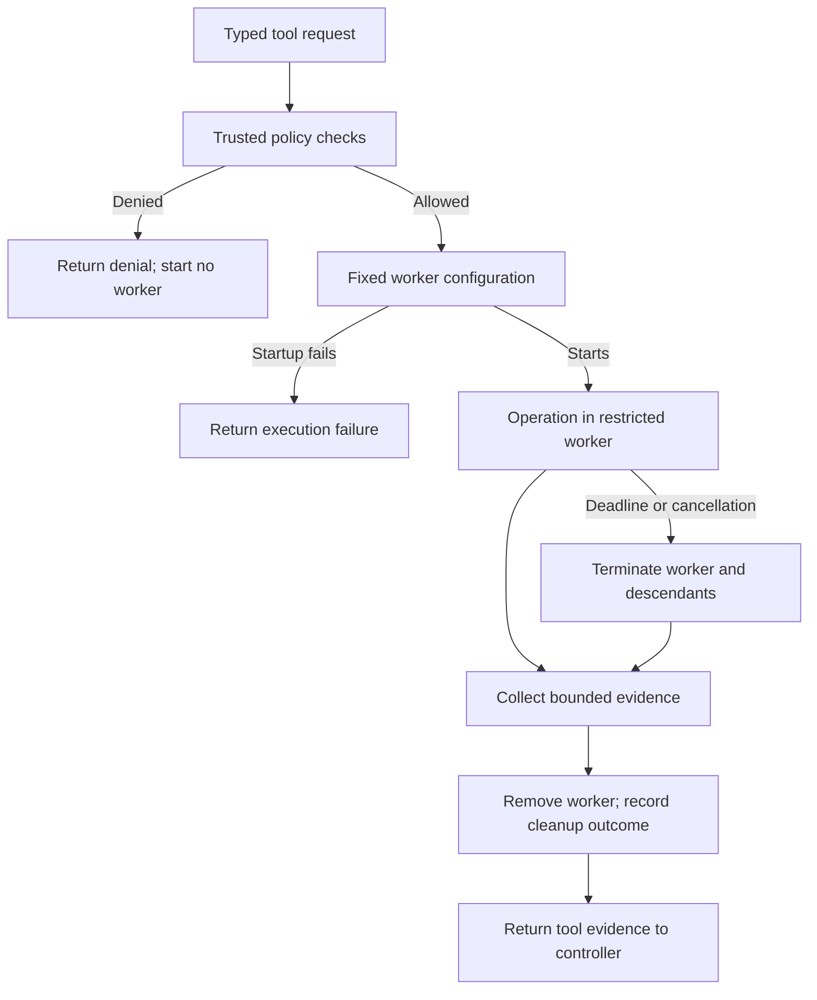

# Pydantic AI Docker Sandbox: setup steps and stopping checkpoint

This is a step-by-step companion to
[Text-controlled Pydantic AI inside Docker Sandboxes](text-controlled-pydantic-ai-docker-sandbox.md).
Follow that document for the architecture requirements and use this file to
work through the sandbox preparation in smaller steps.

**Stop at the end of this file: sandbox setup and isolation readiness.** This
stage ends before submitting a coding task, running an autonomous agent loop,
or implementing the complete result/export workflow.

This file is a guide, not an installed sandbox. The custom kit, controller
entrypoint, worker image, and worker adapter described below still need to be
implemented. Commands that depend on them are marked accordingly. Writing this
guide did not run these commands or establish that the isolation checks pass.

## 1. Understand what you are setting up

Docker **Sandboxes**, operated with `sbx`, creates a microVM with its own Linux
kernel. An ordinary Docker container shares its Linux host's kernel. Your
design uses both: a microVM around the application and containers inside that
VM for tool execution. Linux installations require KVM; macOS installations
have their own platform prerequisites. See Docker's
[isolation documentation](https://docs.docker.com/ai/sandboxes/security/isolation/)
and [installation requirements](https://docs.docker.com/ai/sandboxes/install/).



1. Put the trusted controller, policy code, and Docker client in the microVM.
2. Put every model-requested file operation and process in the inner worker.
3. Give that worker only its disposable task directory.
4. Keep the actual provider key on the host.
5. Keep model inference at the external provider. The request is sent and its
   response processed by the controller inside the VM.

The VM protects the host. The worker adds separation from controller files and
credentials, but it shares the VM's kernel: a kernel-level container escape
could compromise the controller. These are two different isolation boundaries.

**Checkpoint:** you can identify the host, controller, worker, and provider as
four separate places with different responsibilities.

## 2. Confirm prerequisites and record versions

Run these steps **on the host**.

1. Check the supported host requirements in the
   [Docker installation guide](https://docs.docker.com/ai/sandboxes/install/).
   For macOS, the documented requirements are Apple silicon and macOS 14 or
   later. `sbx` does not require Docker Desktop to be installed.
2. Install `sbx` using that guide if it is not already installed.
3. Inspect the installed version and relevant command help:

   ```bash
   sbx version
   sbx create --help
   sbx kit validate --help
   ```

4. Record the exact version used. The parent document targets `sbx` 0.42.x;
   mountless `sbx create` became available in 0.42.0. Recheck syntax when using
   another release. See the
   [release notes](https://docs.docker.com/ai/sandboxes/release-notes/).
5. Sign in:

   ```bash
   sbx login
   ```

6. Select a fixed Python version compatible with this project's
   `pyproject.toml`. It currently requires Python 3.13 or later; the Python 3.12
   example in the older text guide does not satisfy that requirement.
7. Record the controller source revision, `uv` version, and lockfile identity
   alongside the sandbox version.

**Checkpoint:** the host can run `sbx`, and the intended Python and dependency
versions are known. No coding agent has started.

## 3. Choose one provider configuration

Resolve this before wiring credentials. The parent sandbox document uses
OpenAI as its example. The current [main.py](../main.py) instead constructs an
OpenAI-compatible client pointed at OpenCode.

| Setting | Parent document example | Current `main.py` |
| --- | --- | --- |
| Provider URL | OpenAI API | `https://opencode.ai/zen/go/v1` |
| Allowed host | `api.openai.com` | `opencode.ai` |
| Controller environment variable | `OPENAI_API_KEY` | `OPENCODE_API_KEY` |
| Kit service identifier | `openai` | Choose `opencode` consistently |

1. Use the OpenAI column when following the parent document literally.
2. Use the OpenCode column when retaining the current application provider.
3. Match the client URL, environment variable, kit service, credential binding,
   and network host to the same column. Using the OpenAI client library does
   not imply that the destination is `api.openai.com`.
4. Configure only the selected provider for this stage.

The remaining credential examples follow the parent document's **OpenAI**
configuration. The table supplies the corresponding substitutions for the
current application; OpenCode proxy compatibility must be checked before use.

**Checkpoint:** there is one consistent provider configuration on paper.

## 4. Prepare the trusted runtime and custom kit

This is an **implementation checklist**. The repository does not yet contain
the required image or kit; the later creation command depends on this work.

1. Build a custom controller template from a pinned digest of Docker's
   `shell-docker` template. It supplies the VM's Docker Engine. Follow the
   [template guide](https://docs.docker.com/ai/sandboxes/customize/templates/).
2. Include the selected Python version, pinned `uv`, trusted application source,
   and locked dependencies. Resolve dependencies during image preparation so
   ordinary execution does not need package-registry access.
3. Keep the controller separate from target code. Use explicit paths, for example:

   | VM path | Purpose | Mounted into worker? |
   | --- | --- | --- |
   | `/opt/text-coder/controller` | Trusted application and environment | No |
   | `/opt/text-coder/worker` | Trusted worker image assets | No |
   | `/workspace/inbox` | Selected input snapshot | No |
   | `/workspace/tasks/task-001` | Disposable copy for one task | Yes, as `/task` |
   | `/workspace/evidence/task-001` | Controller-owned check results | No |

4. Prepare a worker image containing only the runtime and tools required for
   the initial demo. Give it a fixed non-root UID/GID, such as `1000:1000`.
5. Make the pinned worker image available to the VM-local Docker Engine during
   setup, for example by loading a bundled image archive. Verify its image
   identity there. Merely including a Dockerfile does not preload an image.
6. Create `docker-sandbox-kit/spec.yaml` using schema v2. Set its sandbox image
   to the prepared controller image and its entrypoint to the trusted app's
   absolute launch path. The entrypoint must exist before creating the sandbox.
7. Run the controller as the template's non-root agent user. Do not rely on this
   user alone for isolation: the template grants sudo, and access to the local
   Docker Engine is privileged within the VM.
8. Preserve Docker's `HTTP_PROXY`, `HTTPS_PROXY`, and `NO_PROXY` variables in the
   controller. The worker will receive a separate minimal environment.

Use Docker's [v2 kit reference](https://docs.docker.com/ai/sandboxes/customize/kit-reference/)
for field names. Older v1 kit examples use a different schema.

**Checkpoint:** image identities, filesystem layout, entrypoint, and dependency
installation are concrete. The controller can load without running target code.

## 5. Configure the credential proxy

Run credential storage commands **on the host**.

1. Store the selected provider key interactively:

   ```bash
   sbx secret set openai
   ```

   For the current OpenCode application, use `sbx secret set opencode` instead.
2. Add the corresponding declaration to the kit. This is a fragment, not a
   complete `spec.yaml`:

   ```yaml
   credentials:
     - service: openai
       apiKey:
         name: OPENAI_API_KEY
         proxyManaged: true
         inject:
           - domain: api.openai.com
             header: Authorization
             format: "Bearer %s"
   ```

3. At the first interactive creation, approve the binding for this service and
   only its selected API host. A third-party v2 kit needs this binding in
   addition to a stored secret.
4. Keep raw keys out of the image, task snapshot, `.env` files, command arguments,
   and evidence. Never print the controller environment to check this.
5. Before allowing agent tasks, verify that the client uses the proxy and that
   authentication works through it. A successful request alone does not prove
   the image contains no raw key; check the build inputs and configuration too.

Docker documents service secrets and bindings in
[credential management](https://docs.docker.com/ai/sandboxes/configuration/credentials/).



**Checkpoint:** credential wiring is defined and no raw provider key is part
of the sandbox build or task input.

## 6. Restrict network access and host integrations

Run policy and settings commands **on the host**.

1. Add the selected API host to the kit. OpenAI example:

   ```yaml
   permissions:
     network:
       allow:
         - api.openai.com
   ```

2. Inspect existing policy:

   ```bash
   sbx policy ls
   sbx policy log
   ```

3. Remove or narrow unrelated grants in the applicable local or organization
   policy. A kit allowlist does not automatically cancel broader grants. Follow
   the [network policy documentation](https://docs.docker.com/ai/sandboxes/governance/access-controls/network/).
   Local policy changes can affect other sandboxes on this machine.
4. Finish any image downloads or dependency installation before applying the
   final runtime restriction. During normal operation, allow only the selected
   provider API. Confirm the effective policy after setup.
5. Disable SSH-agent forwarding for this workflow:

   ```bash
   sbx settings set ssh.agentForwardingEnabled false
   sbx daemon restart
   ```

   These are host-wide sandbox settings; the daemon restart can interrupt other
   sandbox work. Docker documents this setting in
   [SSH credential forwarding](https://docs.docker.com/ai/sandboxes/configuration/credentials/#ssh-agent).
6. Use `--no-share-skills` when creating this sandbox, as described in
   [shared skills](https://docs.docker.com/ai/sandboxes/workflows/agent-skills/).
7. Keep host MCP servers and additional host mounts out of this kit. A local
   MCP server runs outside the VM boundary. See Docker's
   [security model](https://docs.docker.com/ai/sandboxes/security/).

**Checkpoint:** effective network grants are understood, SSH forwarding is off,
and the creation configuration has no shared skills or host-tool integrations.

## 7. Validate the kit and create a mountless sandbox

**Prerequisite:** the kit and images from Step 4 exist. Run **on the host**:

```bash
sbx kit validate ./docker-sandbox-kit
sbx kit inspect ./docker-sandbox-kit
sbx create --name text-coder --no-share-skills ./docker-sandbox-kit
```

1. Resolve validation errors before creation.
2. Inspect the image, entrypoint, credentials, permissions, and setup actions.
3. Use a fresh sandbox name. If `text-coder` already exists, inspect it and
   choose another name rather than assuming it has this configuration.
4. Pass no workspace path after the kit. In particular, do not add `.`.
5. Complete the narrowly scoped credential binding from Step 5 if prompted.
6. Inspect the created sandbox's mounts and local Docker Engine. Trusted
   setup diagnostics can be invoked from the host:

   ```bash
   sbx exec text-coder -- id
   sbx exec text-coder -- findmnt
   sbx exec text-coder -- docker info
   ```

7. Confirm there is no caller-repository mount, shared-skills mount, host Docker
   socket, or forwarded SSH-agent socket. Do not dump environment values into
   logs while checking sockets or credentials.

Mountless creation is documented in Docker's
[workspace isolation guide](https://docs.docker.com/ai/sandboxes/security/isolation/#workspace-isolation).
Do not substitute `sbx run <kit>`: that command defaults to sharing the current
directory when creating a sandbox.

**Checkpoint:** the VM exists and its actual configuration matches the intended
boundary. These diagnostics do not execute the target application.

## 8. Stage only the initial demo input

1. Prepare a new host staging directory named `text-coder-input` containing
   only reviewed demo files, such as `target/app.py`.
2. Exclude credentials, `.env`, `.git`, local virtual environments, sockets,
   device files, and links to files outside that directory.
3. Copy it into the mountless VM **from the host**:

   ```bash
   sbx cp ./text-coder-input text-coder:/workspace/inbox
   ```

4. Inspect the resulting paths; confirm where the CLI placed the copied
   directory before using it as input.
5. Have trusted setup code create `/workspace/tasks/task-001`, copy only the
   selected regular files there, and set ownership to the fixed worker UID/GID.
6. Leave controller source and evidence outside that directory.

**Checkpoint:** `/workspace/tasks/task-001` contains a disposable demo copy.
There is no writable connection to the original checkout.

## 9. Define the worker launch and tool routing

The following configuration is for **trusted controller code running inside
the VM**. It is not a host Docker command or a model-callable tool.

```text
docker run
  --name text-coder-worker-task-001
  --pull never
  --network none
  --read-only
  --cap-drop ALL
  --security-opt no-new-privileges
  --pids-limit 64
  --cpus 1
  --memory 512m
  --memory-swap 512m
  --user 1000:1000
  --mount type=bind,src=/workspace/tasks/task-001,dst=/task,rw
  --tmpfs /tmp:rw,noexec,nosuid,nodev,size=64m
  --workdir /task
  <preloaded-worker-image-at-verified-digest>
  <controller-selected-command-and-arguments>
```

This is an argument layout, not a ready-to-paste shell command. Replace the
placeholders in trusted implementation code and pass each argument separately.
Use a worker image whose entrypoint and built-in environment have been reviewed.

1. Fix the image, mounts, UID/GID, network mode, and security options in code.
2. Retain Docker's default seccomp protection. Do not use `--privileged` or
   `seccomp=unconfined` for the worker.
3. Give the worker a minimal environment. Check image `ENV` values and Docker
   client proxy configuration as well as explicit flags; no provider or proxy
   variable should appear in the resulting worker environment.
4. Apply the same boundary to read, search, edit, command, and verification tools.
   Inspect the execution backend used by `Coder()` and every other capability;
   adding a harness capability alone does not establish this routing. Replace
   or disable tools that would execute directly in the controller.
5. Let trusted policy select allowed operations and validate task identity,
   paths, arguments, and budgets before worker launch.
6. Enforce the parent's initial limits: eight model requests, a 120-second task
   deadline, a 30-second command timeout, and 16 KiB combined returned output.
7. On timeout or cancellation, terminate the whole worker container so child
   processes cannot survive. Collect bounded diagnostics and remove it through
   a controller finalizer. A process timeout alone does not guarantee cleanup.
8. Limit workspace disk usage and stored logs as well as returned output.
   Container memory limits do not cap the size of the bind-mounted task files.
9. Fail the operation if the restricted worker cannot start. Do not retry the
   target command in the controller environment.

`--memory-swap 512m` is the **combined memory-plus-swap limit**. When it equals
`--memory 512m`, Docker permits no additional swap. This clarifies the parent
document's “512 MiB each” wording. See Docker's
[resource constraints](https://docs.docker.com/engine/containers/resource_constraints/).



**Checkpoint:** every enabled harness tool has a known execution destination,
and target code can only run in the restricted worker.

## 10. Perform setup checks, then stop

Use small, trusted diagnostic probes through the worker runner. These checks
require the runner implementation; they are not a request to run the coding
agent or execute unreviewed repository code.

| Check | Expected evidence |
| --- | --- |
| Controller identity | Non-root account; controller files outside task mount |
| VM mounts | No caller checkout, shared skills, host Docker socket, or SSH forwarding |
| Worker identity | Fixed non-root UID/GID |
| Worker mount list | Only designated task storage and required runtime mounts |
| Worker environment | No provider keys, placeholders, or proxy credentials |
| Controller-file access from worker | Known controller-only probe path is inaccessible |
| Filesystem writes | `/task` and bounded `/tmp` work; root filesystem writes fail |
| Worker network | Connection to a chosen external destination fails |
| Controller network | Selected API host allowed; an unapproved host denied in proxy logs |
| Provider authentication | Trusted minimal API probe works through proxy; logs omit secrets |
| Worker image | Expected image identity; no runtime image pull |
| Timeout and cleanup | Deliberately long trusted probe is terminated; no worker remains |
| Read/edit tool routing | Trusted demo operation affects only the disposable worker workspace |

Inspect effective configuration as well as probe results. One failed connection
does not by itself prove all network access is blocked. Record pass/fail,
observed exit status, and bounded diagnostics for each check; leave checks
unmarked until they actually run.

### Stop here

- [ ] Host and runtime versions recorded.
- [ ] One provider configuration selected and credential binding verified.
- [ ] Custom kit and preloaded worker image validated.
- [ ] Mountless VM and restricted worker settings inspected.
- [ ] Network, filesystem, credential, and cleanup checks passed.
- [ ] All enabled harness tools route through the restricted worker.

The completed milestone is **the sandbox boundary is ready for the first
bounded coding task**. End this guide at that checkpoint. The agent task loop,
greeting change, independent target verification, and final patch export belong
to subsequent steps in the parent document.
