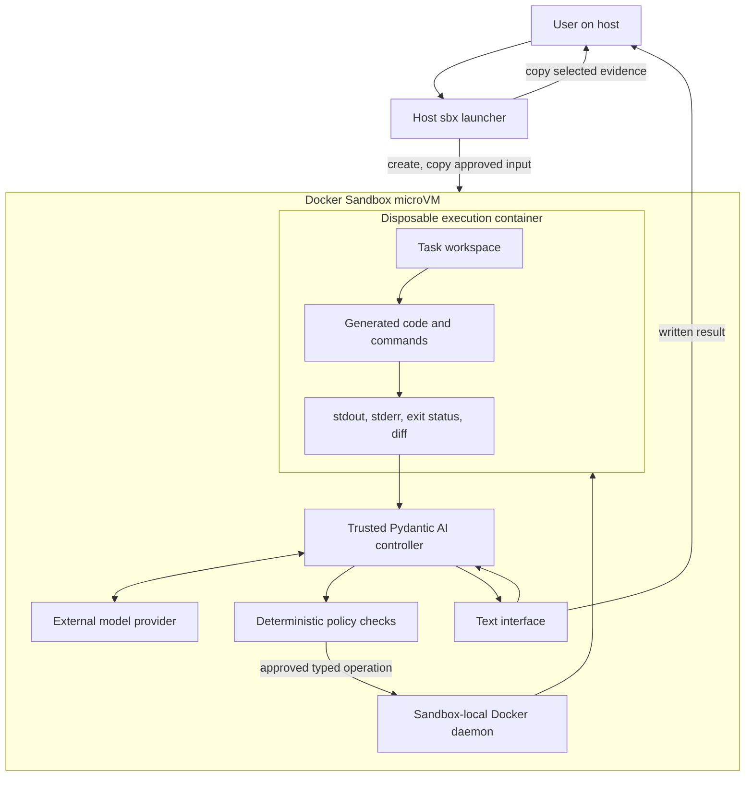

# Text-controlled Pydantic AI inside Docker Sandboxes

This document extends the rules in
[`text-controlled-pydantic-ai-rules.md`](text-controlled-pydantic-ai-rules.md)
with an explicit execution boundary based on Docker's **Docker Sandboxes**
product and its `sbx` CLI. It is an architecture and implementation guide; the
current repository does not yet implement the controller, kit, or worker image
described here.

The required design has two layers of isolation:

1. A Docker Sandbox microVM runs the trusted Pydantic AI controller. Every
   model request, model response, tool dispatch, and final-response operation
   occurs there.
2. A short-lived container, launched with the Docker daemon inside that
   microVM, performs every model-requested file operation, command, generated
   program, and verification step.

Model inference still occurs at the configured external model provider. The
requirement that LLM calls occur in the sandbox means that the HTTP request is
created and sent by the controller inside the Docker Sandbox and its response
is received and processed there. The host only creates the sandbox, copies
approved inputs and outputs, manages credentials and network policy, and
removes the sandbox.

Docker Sandboxes and custom kits are currently Early Access features. Pin the
supported `sbx` version and validate the kit before using these rules in an
unattended environment. The commands below target `sbx` 0.42.x.

## 1. Security boundaries



The Pydantic AI controller is trusted application code. Model output is
untrusted data. The controller must never interpret a model response as direct
permission to use the host, the sandbox-local Docker daemon, or controller
files.

The inner execution container is also untrusted. It must not receive:

- the real model-provider credential or its proxy-managed placeholder;
- the controller source tree, environment, configuration, or process space;
- the Docker socket or Docker CLI;
- host paths or a host Docker socket;
- the outer sandbox's SSH agent, credential files, or proxy variables; or
- network access, unless a later feature grants a narrow, recorded exception.

Do not expose `docker`, `sbx`, arbitrary mount configuration, container image
selection, or container flags as model-callable tools. Only controller code may
construct and launch the worker container.

## 2. Deterministic tool authorization

Pydantic AI validates the registered tool name and typed argument shape. The
controller must then authorize the operation with ordinary code. No second LLM
call approves the first LLM's tool request.

Authorization and sandboxing answer different questions:

- Authorization decides whether this task is permitted to attempt the
  requested operation.
- The worker container limits the damage if authorized repository code or a
  generated command behaves unexpectedly.

For each tool request, perform these checks in order:

1. Accept only a tool registered for the current agent.
2. Validate arguments with a closed schema; reject unknown fields.
3. Load permissions from controller-owned task state, never from model output.
4. Require the task to be active and assigned to the current sandbox and
   workspace.
5. Resolve paths against the task workspace and reject absolute paths, `..`,
   symlink escapes, devices, sockets, and protected controller paths.
6. Map bounded operations to controller-owned commands. For a general command
   tool, validate an argument array and execute it only inside the worker; do
   not pass a model string to a shell.
7. Check model-request, tool-call, time, output, and resource budgets.
8. Check for a controller-recorded human approval when policy requires one.
9. Launch the assigned worker with fixed security flags. If it cannot start,
   fail the tool call without falling back to execution in the controller or
   on the host.
10. Record the decision and return sanitized evidence to Pydantic AI.

The core control flow should be as explicit as this:

```python
async def run_tests(args: RunTestsArgs, context: RunContext) -> ToolEvidence:
    task = await task_store.load(context.task_id)

    if task.status != "running":
        raise ToolDenied("task is not running")
    if "run_tests" not in task.allowed_tools:
        raise ToolDenied("tool is outside task permissions")
    if context.sandbox_id != task.sandbox_id:
        raise ToolDenied("sandbox does not belong to task")
    if args.suite not in {"unit"}:
        raise ToolDenied("unsupported test suite")
    if task.remaining_tool_calls < 1:
        raise ToolDenied("tool-call budget exhausted")

    # Application code chooses the command. The model supplies only `suite`.
    command = ["pytest", "tests/unit"]
    return await worker_runner.execute(
        task_id=task.id,
        argv=command,
        working_directory="/task",
        timeout_seconds=30,
        output_limit_bytes=16 * 1024,
    )
```

A field such as `approved: true` in model output has no authority. Human
approval must be stored by the controller and bound to a task ID, operation,
arguments or digest, expiry, and approving identity. Changing the proposed
operation invalidates that approval.

## 3. Outer Docker Sandbox rules

Use a custom schema-v2 sandbox kit based on Docker's `shell-docker` template.
That template supplies a Docker Engine inside the microVM. Install the pinned
Python version, uv, the locked application dependencies, controller entrypoint,
and worker image definition through the kit or a derived template.

The kit must:

- start the Pydantic AI application as its agent entrypoint;
- declare only the chosen model-provider endpoint in its network permissions;
- declare the provider credential as proxy-managed;
- keep Docker-managed `HTTP_PROXY`, `HTTPS_PROXY`, and `NO_PROXY` values intact;
- use a non-root account for the controller;
- place controller code outside the worker's writable task directory; and
- avoid mounting a host workspace when the sandbox is created.

Use Docker Sandboxes' host-side credential store instead of copying a real key
into `.env` or using `sbx create --env OPENAI_API_KEY=...`:

```bash
sbx secret set openai
```

For a third-party schema-v2 kit, approve a credential binding for the `openai`
service and only the required provider domains. The kit gives the controller a
sentinel value; Docker's host-side proxy replaces it on matching outbound
requests. The real secret must not enter the microVM.

An OpenAI credential declaration in the kit should follow this shape:

```yaml
credentials:
  - service: openai
    apiKey:
      name: OPENAI_API_KEY
      proxyManaged: true
      inject:
        - domain: api.openai.com
          header: Authorization
          format: "Bearer %s"

permissions:
  network:
    allow:
      - api.openai.com
```

Treat this as a version-specific fragment rather than a complete kit. Validate
the final `spec.yaml` with the installed CLI:

```bash
sbx kit validate ./docker-sandbox-kit
sbx kit inspect ./docker-sandbox-kit
```

Use a locked-down global or governance network profile. A kit allow rule does
not necessarily remove access granted by a broader existing policy. Inspect
the effective policy and logs:

```bash
sbx policy ls
sbx policy log
```

For the initial demo, the only runtime destination should be the model-provider
API. Add package registries to the creation-time policy only when setup cannot
be baked into a pinned template. Do not enable open internet access for normal
controller operation.

## 4. Inner execution-container rules

The controller starts a new worker for each tool execution or for one bounded
task session. Prefer a fresh container per task when separate edit and verify
tools must share a workspace. Always remove it during finalization.

Construct `docker run` as an argument list in trusted code. Model data may fill
only previously validated arguments after the image, container, mount, and
security configuration has been fixed by policy.

The baseline worker configuration is:

```text
--network none
--read-only
--cap-drop ALL
--security-opt no-new-privileges
--pids-limit 64
--cpus 1
--memory 512m
--memory-swap 512m
--user <fixed non-root uid>:<fixed non-root gid>
--mount type=bind,src=<task-workspace>,dst=/task,rw
--tmpfs /tmp:rw,noexec,nosuid,nodev,size=64m
--workdir /task
```

Use a pinned worker image digest. Never mount `/var/run/docker.sock`, the outer
sandbox workspace root, `/home/agent`, or `/`. Pass a minimal fixed environment
that excludes every provider, proxy, Git, cloud, CI, and SSH credential. A
container process must not inherit the controller environment.

Use these initial limits unless the task policy sets stricter values:

| Limit | Default |
|---|---:|
| Pydantic AI model requests | 8 |
| Total task deadline | 120 seconds |
| One command | 30 seconds |
| Worker CPU | 1 CPU |
| Worker memory and swap | 512 MiB each |
| Worker processes | 64 |
| Returned stdout and stderr | 16 KiB combined |

Kill the whole worker process group on timeout. Mark truncated output and keep
the full log only in the sandbox's controller-owned evidence area. Never place
unsanitized command output in host logs or model context because repository
code can print secrets or prompt-injection text.

## 5. Workspace and evidence flow

Create the Docker Sandbox without a host workspace mount. A direct `sbx`
workspace mount is visible read-write from both the host and sandbox, which
does not meet this design's separation requirement.

Use this flow:

1. The host creates an outer sandbox with no path argument.
2. The host copies an explicitly selected source snapshot into an inbox with
   `sbx cp`.
3. The controller creates a per-task directory and verifies the copied input.
4. The controller mounts only that directory into the inner worker.
5. The worker edits and verifies the copy.
6. The controller records the changed paths, diff, command arguments, working
   directory, exit code, stdout, stderr, duration, timeout status, policy
   decision, and relevant digests.
7. The host copies only the final evidence bundle or patch out with `sbx cp`.
8. The host removes the Docker Sandbox.

For broader repository work, copy or clone an immutable source revision into
the sandbox and work on a disposable checkout. Never edit the caller's working
tree directly. Reject symlinks that resolve outside the task root before
mounting the workspace into the worker.

## 6. Run and verification commands

After the kit and application are implemented, the host-side lifecycle should
look like this. The host commands manage the boundary; `uv`, Pydantic AI, model
traffic, target execution, and checks run inside it.

```bash
# One-time host configuration.
sbx login
sbx secret set openai
sbx kit validate ./docker-sandbox-kit

# Create without a PATH argument, so there is no host workspace mount.
sbx create --name text-coder ./docker-sandbox-kit

# Copy only the approved source snapshot into the microVM.
sbx cp ./text-coder-input text-coder:/workspace/inbox

# Start the controller inside the Docker Sandbox.
sbx exec text-coder -- uv run --locked python main.py \
  "Change the greeting to Hello Sanil and run it."

# Independently ask the trusted controller to verify the target in a fresh
# restricted worker. `verify-target` is an application command to implement.
sbx exec text-coder -- uv run --locked python main.py verify-target

# Export only the controller-created evidence bundle.
sbx cp text-coder:/workspace/out/result ./text-coder-result

# Remove the microVM and everything left inside it.
sbx rm text-coder
```

Do not replace the independent verification with `sbx exec ... python
target/app.py`; that would run target code in the controller environment. The
`verify-target` application command must invoke the restricted worker and
return its observed exit status and output.

The controller must attempt worker cleanup on success, failure, timeout, and
cancellation. The host launcher must attempt outer-sandbox cleanup after it has
exported the requested evidence. Cleanup should be idempotent so recovery after
a controller or host crash is safe.

## 7. Result and state rules

The model writes a summary, but controller state determines the result status.
Use `succeeded`, `failed`, `cancelled`, and `needs_input` as application states.

Claim `succeeded` only when all of the following are true:

- the tool request passed deterministic policy checks;
- the required change exists in the disposable workspace;
- the configured acceptance check ran inside the restricted worker;
- the evidence matches the requested behavior; and
- the evidence bundle was finalized without relying on model claims.

Example:

```text
Status: succeeded
Changed: target/app.py
Authorization: run_greeting permitted for task task-123
Verification: restricted worker exited 0
Stdout: Hello Sanil
Network: disabled for worker
```

If execution is skipped, say so. If sandbox or worker startup fails, return
`failed` with the failure evidence. Never silently retry a write or fall back to
the outer controller, ordinary Docker on the host, or a host subprocess.

## 8. Acceptance checks

Before expanding beyond the greeting demo, verify all of these scenarios:

1. A valid typed request causes a model call from inside the Docker Sandbox,
   invokes only a registered tool, changes the bounded greeting file in the
   inner worker workspace, and prints the requested greeting during an
   independent worker verification.
2. An unknown tool, unknown argument, unsupported greeting value, exhausted
   budget, inactive task, or mismatched sandbox ID is rejected before worker
   creation.
3. A model request containing `approved: true` cannot create authorization.
4. Absolute paths, traversal, and symlink escapes cannot reach controller or
   outer-sandbox files.
5. The worker cannot reach the network, inspect the provider credential or
   proxy placeholder, access controller files, or use a Docker socket.
6. CPU, memory, process, command-time, task-time, and output limits produce
   explicit failure or truncation evidence.
7. Cancellation stops and reaps the worker, preserves already-created evidence,
   and does not claim rollback.
8. The exported result contains only selected artifacts and their digests.
9. Worker containers and the outer Docker Sandbox are removed after completion;
   cleanup can be repeated safely.

These checks require an implemented kit and application. Creating this document
does not perform a live model request, create a Docker Sandbox, or prove that an
implementation satisfies them.

## References

- [Docker Sandboxes overview](https://docs.docker.com/ai/sandboxes/)
- [Docker Sandboxes isolation layers](https://docs.docker.com/ai/sandboxes/security/isolation/)
- [Docker Sandboxes custom kits](https://docs.docker.com/ai/sandboxes/customize/kits/)
- [Docker Sandboxes templates](https://docs.docker.com/ai/sandboxes/customize/templates/)
- [Docker Sandboxes credential management](https://docs.docker.com/ai/sandboxes/configuration/credentials/)
- [Pydantic AI function tools](https://pydantic.dev/docs/ai/tools-toolsets/tools/)
