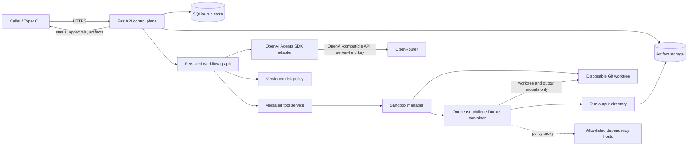
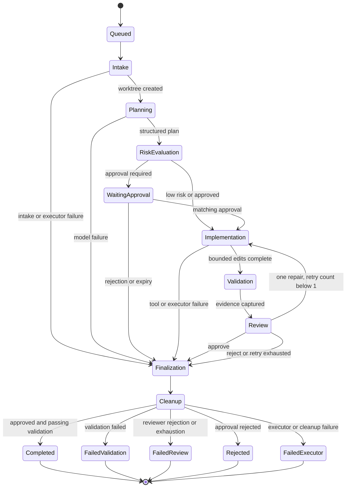
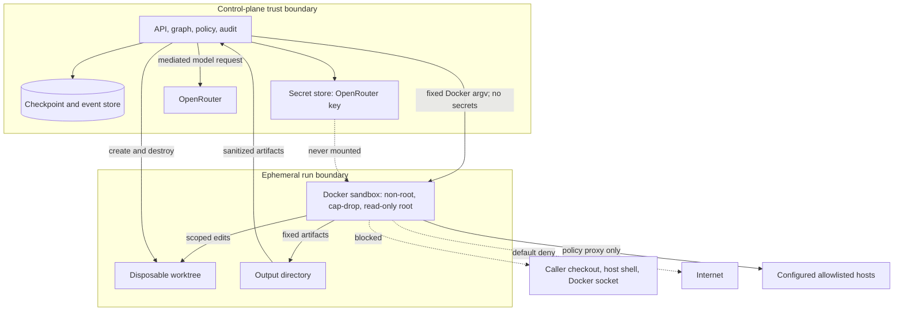

# Agent Orchestration Sandbox Diagrams

## Component architecture

```mermaid
flowchart LR
  CALLER[Caller / Typer CLI] -->|HTTPS| API[FastAPI control plane]
  API --> STORE[(SQLite run store)]
  API --> ART[(Artifact storage)]
  API --> GRAPH[Persisted workflow graph]
  GRAPH --> SDK[OpenAI Agents SDK adapter]
  SDK -->|OpenAI-compatible API; server-held key| OR[OpenRouter]
  GRAPH --> POLICY[Versioned risk policy]
  GRAPH --> MED[Mediated tool service]
  MED --> SM[Sandbox manager]
  SM --> WT[Disposable Git worktree]
  SM --> BOX[One least-privilege Docker container]
  BOX -->|worktree and output mounts only| WT
  BOX --> OUT[Run output directory]
  OUT --> ART
  BOX -. policy proxy .-> EGRESS[Allowlisted dependency hosts]
  API -->|status, approvals, artifacts| CALLER
```

## Run-state graph

```mermaid
stateDiagram-v2
  [*] --> Queued
  Queued --> Intake
  Intake --> Planning: worktree created
  Intake --> Finalization: intake or executor failure
  Planning --> RiskEvaluation: structured plan
  Planning --> Finalization: model failure
  RiskEvaluation --> Implementation: low risk or approved
  RiskEvaluation --> WaitingApproval: approval required
  WaitingApproval --> Implementation: matching approval
  WaitingApproval --> Finalization: rejection or expiry
  Implementation --> Validation: bounded edits complete
  Implementation --> Finalization: tool or executor failure
  Validation --> Review: evidence captured
  Review --> Finalization: approve
  Review --> Implementation: one repair, retry count below 1
  Review --> Finalization: reject or retry exhausted
  Finalization --> Cleanup
  Cleanup --> Completed: approved and passing validation
  Cleanup --> FailedValidation: validation failed
  Cleanup --> FailedReview: reviewer rejection or exhaustion
  Cleanup --> Rejected: approval rejected
  Cleanup --> FailedExecutor: executor or cleanup failure
  Completed --> [*]
  FailedValidation --> [*]
  FailedReview --> [*]
  Rejected --> [*]
  FailedExecutor --> [*]
```

## Data and security boundaries

```mermaid
flowchart TB
  subgraph TRUST[Control-plane trust boundary]
    CP[API, graph, policy, audit]
    DB[(Checkpoint and event store)]
    KEY[Secret store: OpenRouter key]
    CP --> DB
    CP --> KEY
    CP -->|mediated model request| ROUTER[OpenRouter]
  end
  subgraph EPHEMERAL[Ephemeral run boundary]
    W[Disposable worktree]
    D[Docker sandbox: non-root, cap-drop, read-only root]
    O[Output directory]
    D -->|scoped edits| W
    D -->|fixed artifacts| O
  end
  CP -->|fixed Docker argv; no secrets| D
  CP -->|create and destroy| W
  O -->|sanitized artifacts| CP
  D -. blocked .-> HOST[Caller checkout, host shell, Docker socket]
  D -. default deny .-> NET[Internet]
  D -->|policy proxy only| ALLOW[Configured allowlisted hosts]
  KEY -. never mounted .-> D
```
