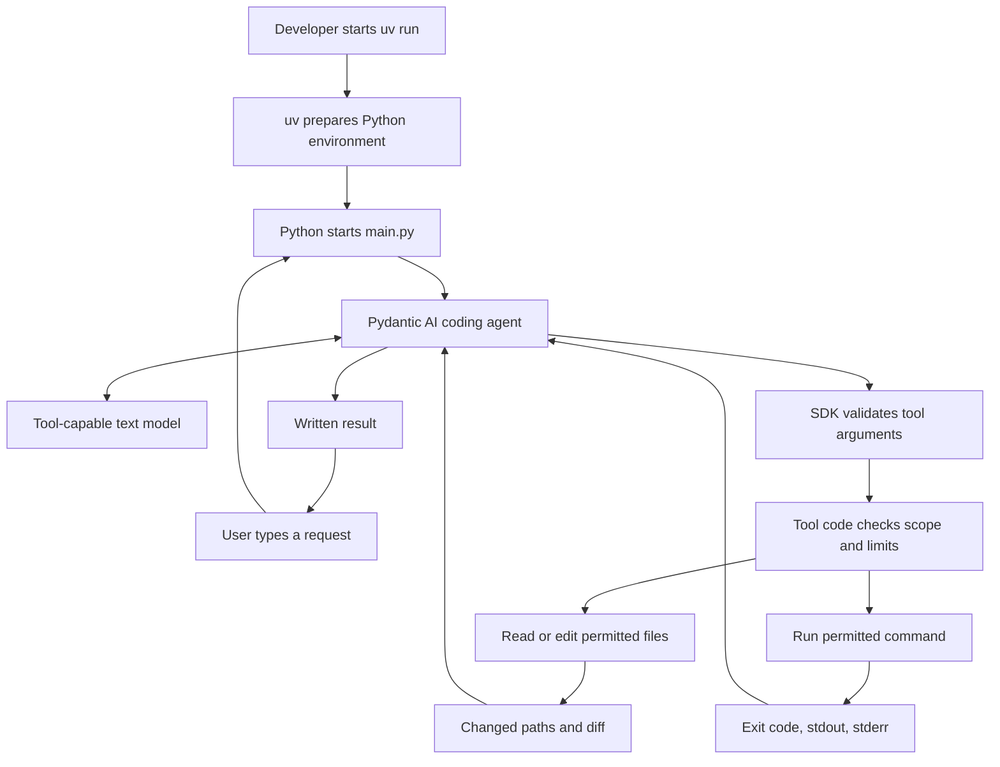
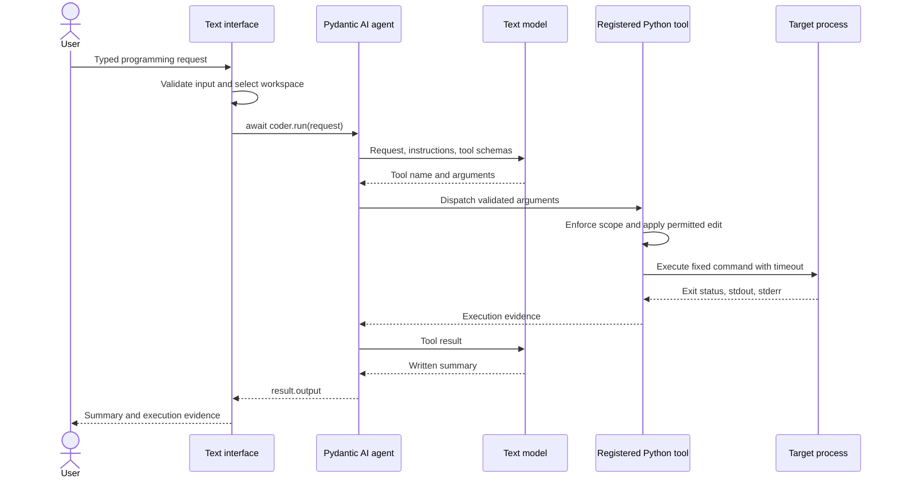
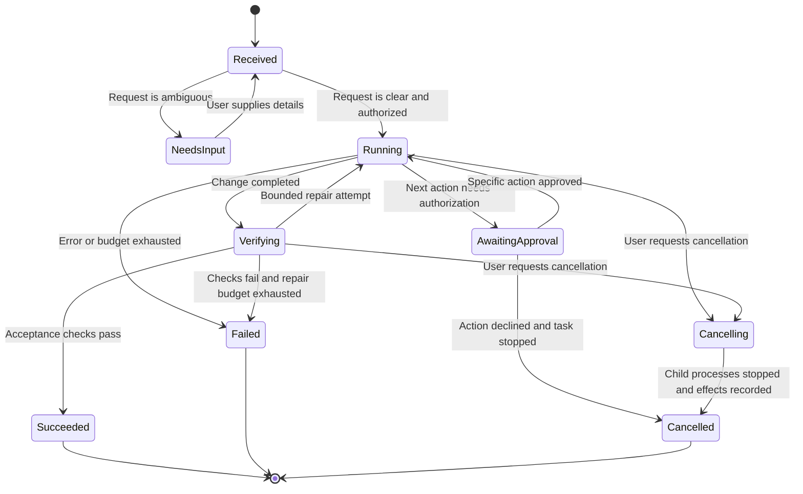

# Text-controlled programming with Pydantic AI and uv

Implementation rules adapted from [the voice-controlled setup](voice-controlled-pydantic-ai-setup.md). This version accepts typed requests and returns text. It uses a tool-capable text model, with no audio model or audio processing.

This document defines the text-only approach; it does not implement the application. Start with the original guide's bounded greeting worker, then extend its capabilities deliberately.

## 1. Architecture rules

1. **Use one coding agent initially.** A CLI or chat backend passes the user's text directly to the coding agent. A separate conversational model and delegation agent are unnecessary for the first version.
2. **Keep the interface textual.** Input is a typed string; output is a written summary, execution evidence, and any clarification needed to continue.
3. **Exclude the audio stack.** Do not configure an audio model, call `Agent.realtime()`, capture a microphone, play speech, or add speech recognition or speech synthesis. Do not install `openai-realtime`, `listentome`, or PortAudio for this application.
4. **Separate reasoning from execution.** The model requests tools. Registered Python functions enforce permissions, access files, and launch processes. The model itself does not execute operating-system commands.
5. **Keep uv responsible for the environment.** uv starts the Python application and manages dependencies. Python and Pydantic AI handle the running application's model/tool loop.

Pydantic AI supports asynchronous agent runs and typed function tools. Tool argument validation belongs to the SDK; application-specific access rules belong in your tool code. See [agents](https://pydantic.dev/docs/ai/core-concepts/agent/) and [function tools](https://pydantic.dev/docs/ai/tools-toolsets/tools/).



## 2. Project and configuration rules

Use this initial layout:

```text
text-coder/
├── .python-version
├── .env                    # Local credentials; never commit
├── .env.example            # Placeholder configuration
├── .gitignore
├── pyproject.toml
├── uv.lock
├── main.py                 # Typed input and printed output
├── coding_agent.py         # Agent, instructions, bounded tools
└── target/
    └── app.py              # Greeting demo output
```

1. Initialize an unpackaged Python application and install only the chosen provider integration. For the same provider as the source guide, use:

   ```bash
   uv python install 3.12
   uv init --app --no-package --python 3.12 text-coder
   cd text-coder
   uv add "pydantic-ai-slim[openai]"
   mkdir -p target
   ```

2. Keep only these application settings in `.env.example` for that provider:

   ```dotenv
   OPENAI_API_KEY=replace-with-your-api-key
   CODING_MODEL=openai:REPLACE_WITH_ACCESSIBLE_TOOL_CAPABLE_TEXT_MODEL
   ```

   The model value is a placeholder. Replace it with a text model available to your account before running. No `VOICE_MODEL` setting is needed.

3. Copy `.env.example` to `.env`, fill in local values, and exclude `.env`, `.env.*`, `.venv/`, and `__pycache__/` from Git. Add `!.env.example` after the environment-file exclusions so the example remains shareable.
4. Commit `pyproject.toml` and `uv.lock`. Use `uv sync --locked` when reproducing the environment. See [uv project management](https://docs.astral.sh/uv/guides/projects/).
5. Keep API keys in the controller. Do not print them, include them in model context, or pass them into a general-purpose generated-code runner.

## 3. Request and agent rules

1. **Reject empty input.** Validate the typed request before starting a model run. Do not substitute a request that changes files when the user submits nothing.
2. **Start with explicit requests.** For the greeting demo, use a request such as `Change the greeting to Hello Sanil and run it.`
3. **Clarify material ambiguity.** Ask a written question when the desired change or target cannot be determined. Continue ordinary authorized work when the request is already clear.
4. **State the worker's scope.** The original `change_and_run` tool only updates a greeting through a fixed Python template. Requests for broader repository changes require additional implemented tools.
5. **Use the normal agent run path.** In an asynchronous entry point, call `await coder.run(...)` and read `result.output`. Set a model request budget, such as `UsageLimits(request_limit=8)`. See [agent runs and usage limits](https://pydantic.dev/docs/ai/core-concepts/agent/).
6. **Bound the whole operation separately.** A model request limit does not enforce subprocess timeouts, output limits, or a total task deadline. Enforce those limits in the controller and runner.
7. **Handle failures explicitly.** Report authentication, provider, validation, and tool failures in text. Do not convert an exception into a success message or retry indefinitely.

For a later repository worker, the controller should assemble this task context before execution:

| Field | Rule |
|---|---|
| Request | Preserve the user's intended change |
| Repository | Resolve to a controller-approved workspace |
| Acceptance criteria | Record observable conditions for completion |
| File references | Include only relevant, permitted context |
| Task ID | Assign a stable identifier when persisting or queueing work |



The sequence shows one successful tool call. Additional calls must remain within the configured task budget.

## 4. Filesystem and execution rules

1. **Keep the first tool bounded.** Retain the source demo's fixed `target/app.py` path, nonempty greeting limit of 200 characters, and Python string-literal serialization. Do not replace the fixed template with unrestricted model-generated source in this local demo.
2. **Enforce repository boundaries in code.** Before adding arbitrary file tools, validate resolved paths and symlinks against the selected workspace. Reject access outside that workspace.
3. **Make changes reviewable.** A general repository worker must retain a diff and changed-file list. Preserve unrelated user edits and use an isolated checkout for broader coding tasks.
4. **Control command execution.** Use argument lists and fixed or allowlisted commands with an explicit working directory. Do not pass model-generated strings to a shell.
5. **Separate arbitrary code execution.** Run general generated code in a disposable environment with explicit filesystem, credential, network, and resource boundaries. Python's `-I` flag alone is not an operating-system sandbox.
6. **Preserve operation order.** Finish an edit before checking it. The greeting demo can keep edit and execution in one `change_and_run` tool; separate tools require controller-enforced ordering.
7. **Serialize writes to the same workspace.** A single sequential CLI run is sufficient initially. Concurrent sessions need a coordinator that prevents overlapping edits and validation against a changing workspace.
8. **Collect real evidence.** Capture the command, working directory, exit status, stdout, stderr, and changed paths. Mark truncated output explicitly and store full logs where appropriate.

## 5. Conversation and task-state rules

1. Start each independent request with fresh context unless the application deliberately supplies relevant prior messages or persisted task state.
2. Resolve references such as “change that again” using explicit task context. Ask for clarification if more than one prior change could match.
3. Keep a task's status separate from the model's prose. Derive success from tool evidence and acceptance checks.
4. For long jobs, return a task ID and written status updates. Add durable task records before promising reconnect or restart recovery.
5. Bind retries to a task ID and inspect recorded effects before repeating a write. A provider retry must not silently duplicate an operation.
6. Treat cancellation as a managed process operation. Stop and reap child processes before reporting `cancelled`; record any edits already made. Cancellation does not imply rollback.
7. Request approval for actions outside the user's existing authorization, such as publishing or destructive changes. Bind approval to the concrete task and proposed action. Ordinary authorized edits can proceed directly.

The following lifecycle is a design for a persistent worker. The source demo does not implement this state machine.



## 6. Response and verification rules

1. Every completed coding task must return a concise written account of what changed and how it was checked.
2. Report changed paths and the actual execution or test outcome. Include a diff or artifact reference when the worker supports repository editing.
3. Distinguish `succeeded`, `failed`, `cancelled`, and `needs_input`. These are application states, not claims the model may invent.
4. Claim success only when the required change exists and its acceptance checks pass. A zero exit status alone does not prove every requested behavior.
5. If execution was skipped, say it was not run. If checks failed, include the failure and any remaining changes.

Example written result, valid only after observing this evidence:

```text
Status: succeeded
Changed: target/app.py
Verification: ran the updated greeting program; exit code 0
Stdout: Hello Sanil
```

## 7. Apply these rules to the source guide

1. Follow its environment setup using the `text-coder` project name and configuration above.
2. Copy `coding_agent.py` from section 5. Its worker already accepts text; its thread wrapper also keeps an asynchronous text interface responsive during execution.
3. Copy `main.py` from section 6, then replace its default request with an empty-input check. When no nonempty request is supplied, print usage and exit before calling `run_change`.
4. Omit the voice setup and voice entry point. Run only the text controller:

   ```bash
   uv run --env-file .env python main.py "Change the greeting to Hello Sanil and run it."
   ```

5. Check Python syntax, then independently rerun the generated target:

   ```bash
   uv run python -m compileall -q main.py coding_agent.py
   uv run python target/app.py
   ```

6. Confirm that the target prints `Hello Sanil`. Syntax checks alone do not verify provider access or the model/tool loop.
7. Before expanding beyond the greeting demo, implement the applicable workspace, runner, evidence, and task-state rules above. Keep future UI changes text-based, whether the entry point becomes a terminal chat, web chat, or API.

Acceptance for the initial version: a typed request changes the bounded greeting program, its execution produces the requested text, and the controller returns a written result without initializing any audio component. Live model execution requires local credentials and has not been performed as part of creating this rules document.
