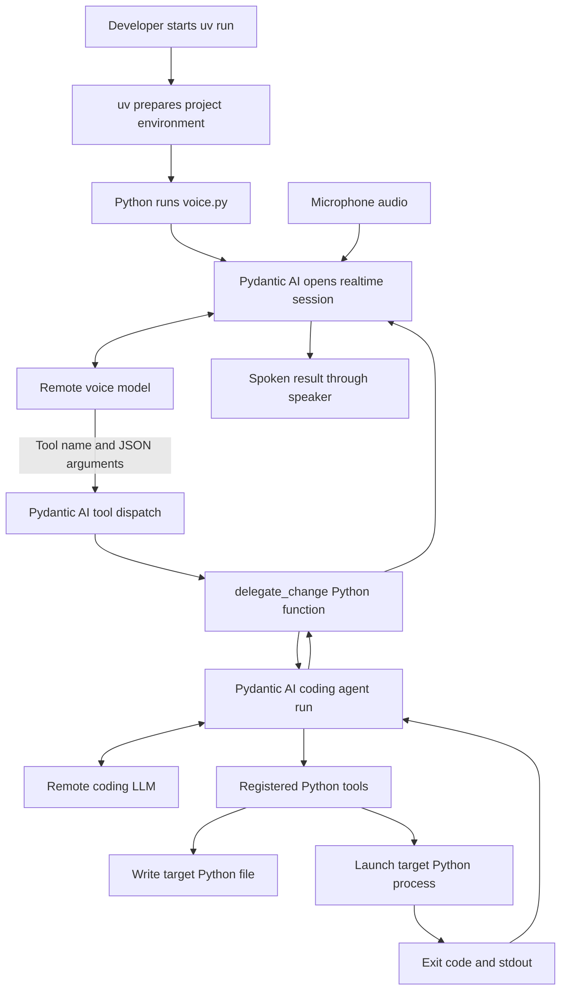
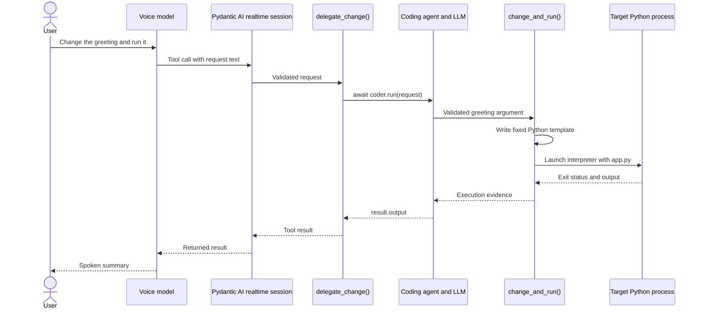

# Voice-controlled programming with Pydantic AI and uv

A practical setup guide · Official documentation checked September 8, 2026

## 1. What you are building

Build two agents in one Python application initially: a realtime voice agent that understands spoken requests, and a coding agent that carries out a bounded programming task. The example below lets you say “Change the greeting to Hello Sanil and run the program.” It changes a real Python file, executes it, and reports the actual output.

Pydantic AI currently documents native speech-to-speech sessions through `Agent.realtime(...)`. Your application still supplies microphone capture and speaker playback. [Realtime overview](https://pydantic.dev/docs/ai/realtime/overview/)

This guide's small coding worker deliberately edits only a greeting through a fixed code template. It is a working handoff demonstration, not a general-purpose repository editor. The staged plan explains how to extend it.

## 2. Understand the two execution chains

**Startup happens first:** you run uv; uv prepares the environment and starts Python; Python constructs the agents and connects to the model provider.

**Delegation happens inside that running program:** the voice model requests a named tool; Pydantic AI validates its arguments and calls your Python function; that function awaits the coding agent; the coding agent requests its own tools; your tool code changes and runs the target application.



The LLM produces a request such as `change_and_run({"greeting": "Hello Sanil"})`. It does not directly call your operating system. The SDK handles the model/tool loop; the registered Python function supplies the actual filesystem and process capabilities. Type annotations describe tool arguments, and the SDK validates those arguments before dispatch. [Function tools](https://pydantic.dev/docs/ai/tools-toolsets/tools/)



## 3. Initialize the project

The following shell commands target macOS/Linux. Install uv if needed:

```bash
curl -LsSf https://astral.sh/uv/install.sh | sh
uv --version
```

On Windows, use the PowerShell installer instead:

```powershell
powershell -ExecutionPolicy ByPass -c "irm https://astral.sh/uv/install.ps1 | iex"
```

See [uv installation](https://docs.astral.sh/uv/). Reopen your terminal if the installer updated PATH.

Create an explicitly unpackaged application to keep the first version easy to follow:

```bash
uv python install 3.12
uv init --app --no-package --python 3.12 voice-coder
cd voice-coder
uv add "pydantic-ai-slim[openai]"
mkdir -p target
```

`--no-package` is intentional: this guide uses top-level Python files rather than an installed `src/` package. Current uv defaults can differ from older tutorials; specifying the layout avoids ambiguity. [Creating projects](https://docs.astral.sh/uv/concepts/projects/init/)

The slim distribution imports as `pydantic_ai`; its `openai` extra supplies the provider integration. You can use the broader `pydantic-ai` distribution instead, but do not need both for this guide. [Pydantic AI installation](https://pydantic.dev/docs/ai/overview/install/)

After adding the files below, your project will look like:

```text
voice-coder/
├── .python-version
├── .env                    # Local credentials; never commit
├── .env.example            # Placeholder configuration
├── .gitignore
├── pyproject.toml          # Maintained by uv add
├── uv.lock                 # Commit this
├── main.py                 # Text entry point
├── coding_agent.py         # Worker and bounded execution tool
├── voice.py                # Microphone, speaker, delegation
├── target/
│   └── app.py              # Created by the worker
└── .venv/                  # Managed by uv
```

`uv add` records dependencies in `pyproject.toml` and updates the lockfile/environment. `uv run` runs inside that environment; you do not need to activate it manually. On another machine, use `uv sync --locked` to install the locked project dependencies. [Working on projects](https://docs.astral.sh/uv/guides/projects/)

## 4. Configure environment variables

Create `.env.example`:

```dotenv
OPENAI_API_KEY=replace-with-your-api-key
CODING_MODEL=openai:gpt-5.6-sol
VOICE_MODEL=openai:gpt-realtime
```

Copy it and fill in your own key:

```bash
cp .env.example .env
```

The coding model is an example used in current Pydantic AI documentation; select a tool-capable model available to your API account. `CODING_MODEL` and `VOICE_MODEL` are this application's settings, read explicitly by our code. `OPENAI_API_KEY` is used by the provider. The current `openai:` text-model prefix selects the Responses integration. [OpenAI provider configuration](https://pydantic.dev/docs/ai/models/openai/)

Append to `.gitignore`:

```gitignore
.env
.env.*
!.env.example
.venv/
__pycache__/
```

Every model-backed run below uses `uv run --env-file .env ...`. uv loads that file before Python imports the modules. An existing shell environment variable takes precedence over the same variable in the file. No `python-dotenv` dependency is needed. [uv environment files](https://docs.astral.sh/uv/configuration/files/#environment-variables)

## 5. Implement the coding worker

Create `coding_agent.py`:

```python
import asyncio
import os
import subprocess
import sys
from pathlib import Path

from pydantic_ai import Agent, ModelRetry
from pydantic_ai.usage import UsageLimits

TARGET = Path(__file__).resolve().parent / "target"

coder = Agent(
    os.environ["CODING_MODEL"],
    instructions=(
        "You maintain a tiny greeting program. For a requested greeting change, "
        "call change_and_run. Report its exit code and actual stdout. "
        "You can only change the greeting; explain that limit for other tasks."
    ),
)


@coder.tool_plain
async def change_and_run(greeting: str) -> dict[str, str | int]:
    """Change the demo application's greeting and execute the updated program."""
    if not greeting.strip() or len(greeting) > 200:
        raise ModelRetry("Use a nonempty greeting of at most 200 characters.")

    def execute() -> dict[str, str | int]:
        TARGET.mkdir(exist_ok=True)
        app = TARGET / "app.py"
        # repr encodes the input as a literal, not executable model-supplied code.
        source = f"def main():\n    print({greeting!r})\n\nmain()\n"
        app.write_text(source, encoding="utf-8")
        # Same interpreter uv selected for the parent application.
        # This demo target uses only Python's standard library.
        completed = subprocess.run(
            [sys.executable, "-I", str(app)],
            cwd=TARGET,
            capture_output=True,
            text=True,
            timeout=10,
            check=False,
        )
        return {
            "file": "target/app.py",
            "exit_code": completed.returncode,
            "stdout": completed.stdout,
            "stderr": completed.stderr,
        }

    return await asyncio.to_thread(execute)


async def run_change(request: str) -> str:
    result = await coder.run(
        request,
        usage_limits=UsageLimits(request_limit=8),
    )
    return result.output
```

This is original demo tool logic: combining the edit and execution in one tool guarantees their ordering. Running the synchronous subprocess in a thread keeps the audio event loop responsive. The tool uses a fixed filename and serializes the greeting as a Python string literal.

`Agent.run()` performs an asynchronous run and returns an object whose `.output` is the final answer. `UsageLimits` bounds model requests for this worker run. The synchronous equivalent, `run_sync()`, is useful for standalone scripts; use `await ...run()` when already inside an async voice session. [Agents and usage limits](https://pydantic.dev/docs/ai/core-concepts/agent/)

This local demo assumes its `target/` directory is controlled by you. Python's `-I` is interpreter isolation, **not an operating-system sandbox**. Do not expand this into arbitrary generated-code execution on your host without a separate execution boundary.

## 6. Prove the text path before adding audio

Replace the generated `main.py` with:

```python
import asyncio
import sys

from coding_agent import run_change


async def main() -> None:
    request = " ".join(sys.argv[1:]) or "Change the greeting to Hello Sanil and run it."
    print(await run_change(request))


if __name__ == "__main__":
    asyncio.run(main())
```

Run the controller:

```bash
uv run --env-file .env python main.py "Change the greeting to Hello Sanil and run it."
```

Expected evidence: `target/app.py` exists, the tool's subprocess exits with status `0`, and its stdout contains `Hello Sanil`. The model's final wording may vary. You can independently rerun the target:

```bash
uv run python target/app.py
```

These commands run different things: the first starts your agent application; the second starts the application that the agent changed. The sample's execution tool starts that second Python process directly, using the interpreter already selected by uv.

For a future target repository with its own dependencies, initialize and lock it separately, then have a controlled runner execute a fixed command such as `uv run --locked python app.py` with that repository as its working directory. Keep dependency installation and arbitrary command selection outside the model's unrestricted control.

## 7. Add realtime voice

Install the realtime transport and local audio dependencies:

```bash
uv add "pydantic-ai-slim[openai,openai-realtime]" anyio listentome
```

The realtime extra is documented in the [realtime quickstart](https://pydantic.dev/docs/ai/realtime/overview/). For local audio, install PortAudio on macOS with `brew install portaudio`, or on Debian/Ubuntu with `sudo apt install libportaudio2`. Allow microphone access when your OS asks. [Official voice example](https://pydantic.dev/docs/ai/examples/realtime/realtime-voice/)

Create `voice.py`:

```python
import asyncio
import os

import anyio
import listentome
from pydantic_ai import Agent

from coding_agent import run_change

voice = Agent(instructions=(
    "You are a voice interface for a greeting-program coding demo. "
    "Use delegate_change for programming requests. Keep replies brief. "
    "Only claim execution succeeded when the tool reports success."
))
worker_lock = asyncio.Lock()


@voice.tool_plain
async def delegate_change(request: str) -> str:
    """Ask the coding worker to change and run the greeting program."""
    async with worker_lock:
        return await run_change(request)


async def main() -> None:
    realtime = voice.realtime(os.environ["VOICE_MODEL"])
    async with realtime.session(handle_barge_in=True) as session:
        mic = listentome.InputStream(
            samplerate=session.audio_input_sample_rate,
            channels=1, dtype="int16",
            blocksize=session.audio_input_sample_rate // 10,
        )
        speaker = listentome.OutputStream(
            samplerate=session.audio_output_sample_rate,
            channels=1, dtype="int16",
        )
        async with mic, speaker, anyio.create_task_group() as tasks:
            async def playback():
                async for chunk in session.stream_audio():
                    await speaker.write(chunk)

            tasks.start_soon(session.send_audio, mic)
            tasks.start_soon(playback)
            print("Listening. Press Ctrl-C to stop.")
            async for _event in session:
                pass
            tasks.cancel_scope.cancel()


if __name__ == "__main__":
    try:
        anyio.run(main, backend="asyncio")
    except KeyboardInterrupt:
        pass
```

The audio wiring follows the [official microphone/speaker example](https://pydantic.dev/docs/ai/examples/realtime/realtime-voice/); the delegation tool is specific to this project. Iterating the session drives event consumption while the input and playback tasks handle audio.

Start it:

```bash
uv run --env-file .env python voice.py
```

Say: **“Change the greeting to Hello from my voice agent and run it.”** Then inspect `target/app.py` or run it yourself to confirm the change.

The voice session exposes only `delegate_change`. The SDK executes that tool on your backend; our function invokes the separate coding agent and returns its result. Realtime tools can run concurrently, so the demo lock serializes worker requests during an ordinary call. [Realtime tool execution](https://pydantic.dev/docs/ai/realtime/tools/)

## 8. Keep voice and coding responsibilities separate

| Component | Owns | Returns |
|---|---|---|
| Voice agent | Audio conversation, clarification, concise spoken feedback | A concrete task request |
| Delegation function | Request routing and worker invocation | Worker result |
| Coding agent | Programming reasoning and tool selection | Change summary backed by execution evidence |
| Execution tools | Filesystem changes and actual processes | Exit code, stdout, stderr, changed paths |
| uv | Python/dependency environment and process startup | A running Python application |

Separate agent objects are enough for learning. Later, place the worker in its own process/container and expose `submit_task`, `task_status`, and `cancel_task`. Return a task ID immediately for long jobs. Keep detailed diffs and logs in the UI; speak short progress updates and the final result.

Do not pass the entire audio conversation as the coding task by default. Send a concise request plus the chosen repository, acceptance criteria, and relevant file references. For “undo that” or follow-up edits, persist explicit task state or message history; this minimal worker starts a fresh run each time.

Speech interruption and job cancellation are different operations. Barge-in can stop spoken playback; it does not roll back file changes. In this prototype, cancellation while `asyncio.to_thread` is running can leave the subprocess finishing in the background. Before supporting cancellation, move execution into a managed worker that tracks child processes, completion, and cleanup. The in-process lock is not a durable job coordinator.

## 9. Staged build plan

| Stage | Build | Done when |
|---|---|---|
| 1. Environment | uv project, dependencies, `.env` | Imports work and a model request succeeds |
| 2. Text worker | `coding_agent.py` and `main.py` | A greeting change produces the expected stdout |
| 3. Voice | `voice.py`, audio devices, delegation | A spoken request produces the same verified change |
| 4. Repository editing | Read/list tools and patch application in a disposable checkout | A requested change yields a reviewable diff |
| 5. Verification | Fixed test/run commands in an isolated worker | Results include exit status and meaningful test evidence |
| 6. Long jobs | Queue, task IDs, progress, explicit cancellation | Conversation remains usable while a job runs |
| 7. Reliability | Persistent task records, duplicate detection, recovery | Reconnects/retries do not repeat an edit unexpectedly |

For general coding, add tools gradually: read selected files, propose/apply a patch, inspect a diff, run an allowlisted test command. Enforce repository boundaries in tool code, including resolved-path and symlink handling. A prompt requesting caution does not enforce filesystem access. Execute generated code in a disposable environment with deliberate file mounts, environment variables, network access, and resource limits. Never give that process the controller's API key by default.

Add confirmation where the product needs it, such as deleting files or publishing changes. Ordinary authorized edits can proceed directly. If confirmation is spoken, bind it to a specific task or patch so a casual “yes” cannot approve an unrelated action.

## 10. Verification and troubleshooting

Before a live call:

```bash
uv run python -m compileall -q main.py coding_agent.py voice.py
uv run python -c "from pydantic_ai import Agent; print(hasattr(Agent, 'realtime'))"
uv tree
```

- **`realtime` is missing:** your installed version predates these docs. Upgrade with `uv lock --upgrade-package pydantic-ai-slim`, then `uv sync`; inspect the changed lockfile and repeat the checks.
- **Authentication/model error:** check `.env`, model access, and whether a shell variable overrides the file. Never print the API key while debugging.
- **No microphone/speaker:** check OS permissions, PortAudio, and your default audio device. Use headphones to reduce feedback.
- **The agent only explains the change:** verify the tool is registered and the prompt asks for the supported greeting edit. The changed file and process output are the evidence.
- **The voice session closes on an error:** this minimal example lets exceptions surface. Add controlled error reporting and job status before making it a persistent service.
- **A Mermaid block appears as text:** open the file in a Markdown viewer that supports Mermaid, such as a compatible editor preview or GitHub.

Validation scope for this guide: Python snippets were syntax-checked locally. Live model requests and microphone/speaker behavior require your credentials and hardware and were not exercised during guide creation. Dependency resolution and runtime API compatibility should be confirmed with the commands above; the official links document the API conventions used.
